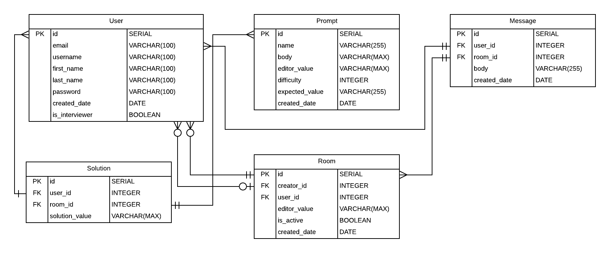

# BlueBoard Database
BlueBoard's database uses PostgreSQL and is hosted on AWS

## Entity Relationship Diagram

## Tables

#### User Table

<table>
    <th>Key</th>
    <th>Field</th>
    <th>Type</th>
    <th>Description</th>
    <tr>
     <td>PK</td>
     <td>id</td>
     <td>SERIAL</td>
     <td>User ID primary key</td>   
    </tr>
    <tr>
     <td></td>
     <td>email</td>
     <td>VARCHAR(100)</td>
     <td>User's email</td>   
    </tr>
    <tr>
     <td></td>
     <td>username</td>
     <td>VARCHAR(100)</td>
     <td>User's username</td>   
    </tr>
    <tr>
     <td>PK</td>
     <td>id</td>
     <td>SERIAL</td>
     <td>User ID primary key</td>   
    </tr>
    <tr>
     <td>PK</td>
     <td>id</td>
     <td>SERIAL</td>
     <td>User ID primary key</td>   
    </tr>
    <tr>
     <td>PK</td>
     <td>id</td>
     <td>SERIAL</td>
     <td>User ID primary key</td>   
    </tr>
    <tr>
     <td>PK</td>
     <td>id</td>
     <td>SERIAL</td>
     <td>User ID primary key</td>   
    </tr>
    <tr>
     <td>PK</td>
     <td>id</td>
     <td>SERIAL</td>
     <td>User ID primary key</td>   
    </tr>
</table>